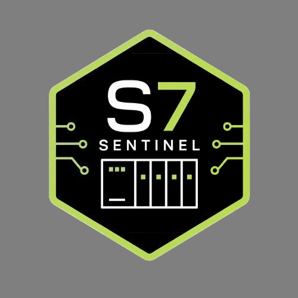

<p align="center">
  
</p>

# S7Sentinel

**Defensive Siemens S7 / OT security assessment and agentic-intrusion telemetry analysis.**

S7Sentinel is a dependency-light Python security toolkit built for operators, defenders, integrators, and incident-response teams working around industrial control systems. It translates concrete defensive recommendations from U.S. Cybersecurity Advisory **AA26-231A (2026-08-19)** into machine-evaluable checks and adds a second behavioral profile derived from the supplied Dream Research Labs report describing a highly automated multi-agent intrusion campaign observed in July 2026.

The project is deliberately defensive. It does **not** exploit PLCs, write PLC memory, retrieve ladder logic, brute-force credentials, solve CAPTCHAs, forge JWTs, upload persistence, perform Internet-wide discovery, or execute files that it finds.

> **Operational safety:** production OT systems can have physical consequences. Use active network checks only on systems you own or are explicitly authorized to assess, and coordinate with control engineers and site change-control procedures.

## Why this exists

Modern OT defense faces two converging problems. First, exposed and weakly segmented PLCs remain reachable through protocols such as S7comm on TCP/102. Second, AI-assisted agent frameworks can compress reconnaissance, credential abuse, API discovery, and multi-system pivoting into highly parallel automated operations.

S7Sentinel addresses the defensive side of both problems with five modes:

| Command | Purpose | Network effect |
|---|---|---|
| `scan` | AA26-231A PLC inventory posture and conservative TCP reachability | Optional TCP connect only |
| `hostcheck` | Snap7/python-snap7 artifact hunt on engineering hosts | None |
| `logcheck` | S7comm/OT event anomaly analysis | None |
| `agentcheck` | Hermes/OpenClaw-style local artifact review | None |
| `agentlog` | Identity/web/API telemetry analysis for AI-orchestrated intrusion patterns | None |
| `profile` | Print built-in defensive profiles | None |

## Highlights

- Runtime has no third-party Python dependencies.
- Offline inventory mode sends **zero network traffic**.
- Active PLC checks are limited to ordinary TCP reachability; no S7 application-layer interaction is required.
- Public CIDR expansion is refused by design.
- Local artifact inspection reads files as data and never imports or executes them.
- Normalized telemetry analysis detects password-spray patterns, cross-system SSO pivots, parallel endpoint enumeration, unsigned JWT acceptance indicators, unauthenticated sensitive APIs, suspicious server-side uploads, large sensitive responses, and automation-rate anomalies.
- Findings distinguish observation, inference, and verified local advisory matches.
- JSON output is suitable for automation; PLC posture also supports a standalone HTML report.
- Defensive evidence aggregation uses a Bayesian-style priority score for analyst triage, explicitly **not** as a probability of compromise.
- ATT&CK/D3FEND references are included where the source advisory provides or the implementation uses stable, well-established mappings.

## Quick start

Requires Python 3.10+.

```bash
python -m venv .venv
source .venv/bin/activate
python -m pip install -e .
s7sentinel --version
```

Windows PowerShell:

```powershell
py -m venv .venv
.\.venv\Scripts\Activate.ps1
py -m pip install -e .
s7sentinel --version
```

### 1. Zero-traffic PLC posture review

```bash
s7sentinel scan \
  --inventory examples/inventory.csv \
  --no-network
```

Outputs:

- `s7sentinel-report.json`
- `s7sentinel-report.html`

### 2. Authorized TCP/102 reachability check

```bash
s7sentinel scan \
  --targets 10.50.20.0/28 \
  --inventory examples/inventory.csv \
  --authorized
```

The active check only attempts TCP connections to configured ports. It does not issue S7 protocol commands.

### 3. Engineering workstation artifact review

```bash
s7sentinel hostcheck \
  --roots /opt/engineering,/srv/tools \
  --hash
```

Windows:

```powershell
s7sentinel hostcheck --roots "C:\Engineering,C:\ProgramData" --hash
```

### 4. S7comm telemetry analysis

```bash
s7sentinel logcheck \
  --csv examples/s7-events.csv \
  --maintenance-start 07:00 \
  --maintenance-end 19:00
```

### 5. Agentic workspace artifact review

```bash
s7sentinel agentcheck \
  --roots /srv,/opt,/home \
  --hash
```

This looks for contextual indicators such as `.hermes` and `.openclaw` workspaces and related planning/report markers. Presence alone is not proof of compromise.

### 6. Multi-agent intrusion telemetry analysis

```bash
s7sentinel agentlog \
  --csv examples/agentic-events.csv
```

The `agentlog` mode is built for normalized identity, web, API gateway, WAF, SSO, reverse-proxy, and application telemetry. It does not perform any offensive action against the systems represented in those logs.

### 7. Inspect defensive profiles

```bash
s7sentinel profile
s7sentinel profile aa26-231a
s7sentinel profile dream-agentic-2026
```

## AA26-231A coverage

The PLC posture model covers the advisory's major defensive themes:

- S7-200, S7-300, S7-400, S7-1200, and S7-1500 inventory;
- exact firmware tracking;
- known-good/gold-copy verification;
- Internet exposure and TCP/102 reachability;
- OT/IT segmentation evidence;
- remote access and MFA;
- engineering-workstation restrictions;
- PLC password/protection-level status;
- SNMP hardening;
- application allowlisting;
- S7comm logging and monitoring;
- unnecessary web/protocol exposure;
- session/connection-limit posture;
- restart and know-how protection status;
- ladder-logic/configuration integrity evidence;
- local, operator-verified ProductCERT/CISA advisory correlation.

The tool intentionally does not invent CVEs or firmware thresholds. Exact vulnerability rules must be supplied from authoritative sources in `--advisories` JSON.

## Agentic intrusion profile

The second profile is a defensive interpretation of the supplied Dream Research Labs report describing a multi-agent framework using Hermes/OpenClaw-style workspaces, parallel task dispatch, repeated reconnaissance, credential attacks, SSO pivoting, JWT weaknesses, unauthenticated APIs, file-upload abuse, and high-volume automation.

S7Sentinel detects **defensive evidence** of those behaviors. It does not reproduce them.

Key detections include:

| Detection | Example evidence | Default severity |
|---|---|---|
| `PASSWORD_SPRAY_PATTERN` | one source fails authentication against many users in a short window | HIGH |
| `PARALLEL_ENDPOINT_RECON` | one source touches many endpoint/system pairs rapidly | HIGH |
| `CROSS_SYSTEM_SSO_PIVOT_PATTERN` | one identity/source succeeds across multiple systems rapidly | HIGH |
| `JWT_NONE_ALGORITHM_OBSERVED` | unsigned JWT marker, especially when accepted | MEDIUM/CRITICAL |
| `UNAUTHENTICATED_SENSITIVE_API_SUCCESS` | sensitive endpoint succeeds with no authenticated method | CRITICAL |
| `SERVER_SIDE_FILE_UPLOAD` | successful upload of a server-executable file type | HIGH |
| `LARGE_SENSITIVE_RESPONSE` | large response from sensitive/export-like operation | HIGH |
| `AUTOMATED_ACTIVITY_BURST` | unusually high event volume from one source | MEDIUM |
| `AGENTIC_WORKSPACE_DIRECTORY` | `.hermes` or `.openclaw` directory | MEDIUM review signal |

Thresholds are configurable on the CLI because normal behavior varies substantially across environments.

## Safety model

S7Sentinel enforces several guardrails in code:

1. Network scans require `--authorized`.
2. RFC1918 CIDRs may be expanded; non-RFC1918 CIDRs are refused.
3. Individually supplied non-RFC1918 IPs require `--allow-public` and `--authorized`.
4. The scanner performs TCP connection checks only.
5. No credential testing is implemented.
6. No PLC write/read primitives are implemented.
7. Artifact scanners never import or execute discovered source code.
8. Agentic telemetry checks operate only on supplied log data.
9. Invalid CSV evidence fails loudly instead of silently degrading into a clean report.

Read [SECURITY.md](SECURITY.md) and [docs/threat-model.md](docs/threat-model.md) before production use.

## Exit codes

| Code | Meaning |
|---|---|
| `0` | command completed and no HIGH/CRITICAL condition requiring the command's failure policy was found |
| `1` | command completed and actionable HIGH/CRITICAL findings were detected, or local review artifacts were found where documented |
| `2` | input, authorization, validation, or operational error |

Treat exit code `1` as "review required," not as proof of compromise.

## Repository map

```text
s7sentinel/
├── .github/                 GitHub Actions, issue forms, PR template
├── docs/                    architecture, threat model, deployment, white paper
├── examples/                safe synthetic CSV examples
├── rules/                   local defensive profiles and advisory examples
├── s7sentinel/              Python package
├── scripts/                 maintainer/release helpers
├── tests/                   unit tests
├── CHANGELOG.md
├── CODE_OF_CONDUCT.md
├── CONTRIBUTING.md
├── CREDITS.md
├── GOVERNANCE.md
├── LICENSE
├── NOTICE.md
├── README.md
├── ROADMAP.md
├── SECURITY.md
├── SUPPORT.md
└── pyproject.toml
```

## Development

```bash
python -m pip install -e .
python -m unittest discover -s tests -v
python -m compileall -q s7sentinel
python -m build
```

Optional maintainer tooling:

```bash
python -m pip install -r requirements-dev.txt
ruff check s7sentinel tests
```

See [CONTRIBUTING.md](CONTRIBUTING.md).

## Data handling

S7Sentinel has no built-in telemetry service, cloud backend, analytics, or phone-home behavior. Reports are written locally to paths selected by the operator. Operators remain responsible for protecting sensitive asset inventories and security telemetry.

See [docs/data-handling.md](docs/data-handling.md).

## Status and scope

S7Sentinel is an independent defensive project. References to Siemens, CISA, NSA, FBI, DOE, EPA, MITRE, Dream Research Labs, Hermes, OpenClaw, Snap7, or other products and organizations are for interoperability, threat-context, attribution-to-source, and defensive documentation purposes only. No endorsement or affiliation is implied.

## License

MIT License. See [LICENSE](LICENSE).

## Security disclosures

Please do **not** open a public GitHub issue for a vulnerability in S7Sentinel that could create security impact. Follow [SECURITY.md](SECURITY.md).
